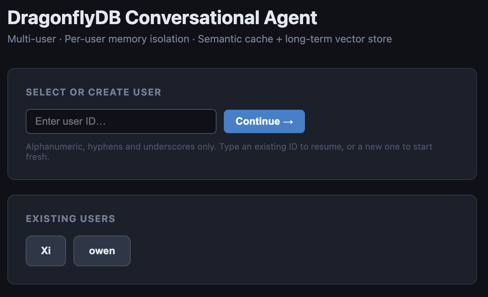
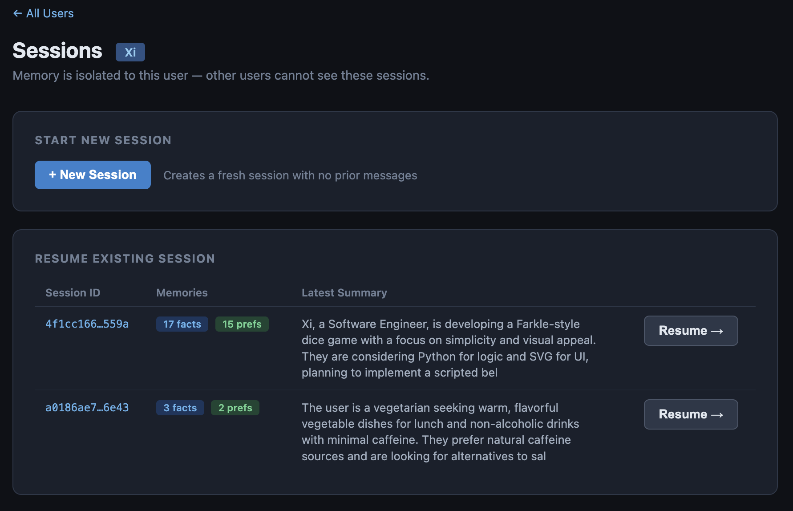
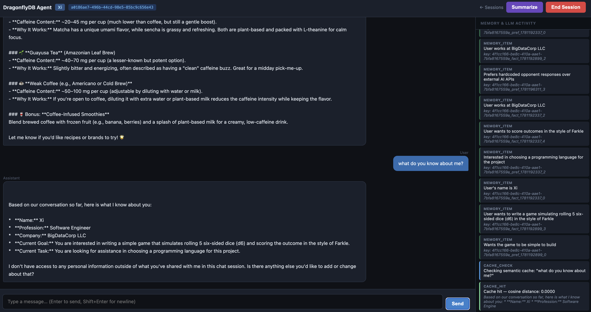

# vibe_DFLY_Conversational_agent
Demonstrates how a simple chat bot can leverage parts of the redis-compatible open source libraries to utilize memories and facts stored in Dragonfly.





## This project is a simple example of using redisvl and langgraph to implement semantic caching and capture facts and memories 

#### It may grow to include more agent-worflow MCP support enabled by redis/dragonfly tools and skills

#### The application can use either LocalAI or mlx-lm or pretty much any chat-ready http accessible model framework

#### The application will need some http-accessible llm service so make certain you start one or can connect to one

<details><summary>LocalAI Details:</summary>
<p />
For installation and management information see: 
https://github.com/mudler/LocalAI 

```
LocalAI: Built primarily in Go and utilizing Docker containers, it is an enterprise-grade backend. It functions as a drop-in replacement for OpenAI API, allowing developers to plug local text, audio, and image generation models into existing apps.

LocalAI: Cross-platform and hardware-agnostic. It can be deployed via Docker on Linux, Windows, or macOS, and supports both CPUs and Nvidia GPUs.

Best for developers, sysadmins, or teams who want to self-host an entire API infrastructure, run AI in CI/CD pipelines, or integrate local voice and image features into their own software.
```

</details>

### In agent.py you will find the setup for connecting to the http accessible LLM and the embedding model for semantic cache use:

Adjust these to suit your deployment / preferred LLM etc

```
LLM_BASE_URL = "http://localhost:6060/v1"
LLM_MODEL = "mlx-community/Qwen3-14B-4bit"
#LLM_MODEL = "qwen3.5-9b-glm5.1-distill-v1"
#LLM_MODEL = "lfm2.5-8b-a1b"
EMBEDDING_MODEL = "sentence-transformers/all-mpnet-base-v2"
EMBEDDING_DIMS = 768  # all-mpnet-base-v2 output dimension
CACHE_INDEX_NAME = "llm_semantic_cache"
EXTRACTION_EVERY_N = 7
TOKEN_LIMIT = 24576
```

******

# Python Environment Setup V1

Version 1:  Old school way of creating a venv and using requirements.txt to load dependencies:

<details><summary>Python Setup v1 Details:</summary>
<p />

- **A: Create a virtual environment:**

```
python3 -m venv lcenv
```

- **B. Activate it:  [This step is repeated anytime you want this venv back]**

```
source lcenv/bin/activate
```

On windows you would do:

```
lcenv\Scripts\activate
```
If no permission in Windows
 The Fix (Temporary, Safe, Local):
In PowerShell as Administrator, run:
```

Set-ExecutionPolicy -Scope CurrentUser -ExecutionPolicy RemoteSigned
```
Then confirm with Y when prompted.


- **C. Install the libraries: [only necesary to do this one time per environment]**

```
pip3 install -r requirements.txt
```

</details>


# Python Environment Setup version 2:  Using uv 

### The following setup expects you to use mlx-lm which is better at taking advantage of the power of a modern macbook and doesn't run the LLM in a container as LocalAI does

<details><summary>uv and mlx-lm Details:</summary>
<p />

```
## install uv:
brew install uv
## create a venv and use a recent build of python:
uv venv lcenv --python 3.12
## add the required libraries (here I am using mlx-lm as my LLM framework)
uv pip install --python lcenv/bin/python -r requirements.txt mlx-lm

```

</details>

### <em>---NB If you are using mlx-lm You can edit and use the provided start script called 'launch.sh' to start mlx-lm and the app.py </em>
#### * It specifies the listen ports for both mlx-lm and the app.py as well as the model to load into mlx-lm.  If mlx-lm does not already have the model downloaded, it will do so when you start it which could take a while as most models are several GB 
#### * It expects for there to be a configured and library ready sub-directory called lcenv  (this is created in the python setups above)

## Whatever way you choose to configure and start the app:  The main entry point is a webapp called app.py which you gets started with various args:

```
python3 app.py [-H host] [-p port] [-s password] [-u username] [--threshold float] --web-port port

```

### Example where the webapp is available on port 9026 and it connects to DragonFly on port 7900:

```
 python3  app.py --web-port 9026 -H localhost -p 7900
 
 ```


